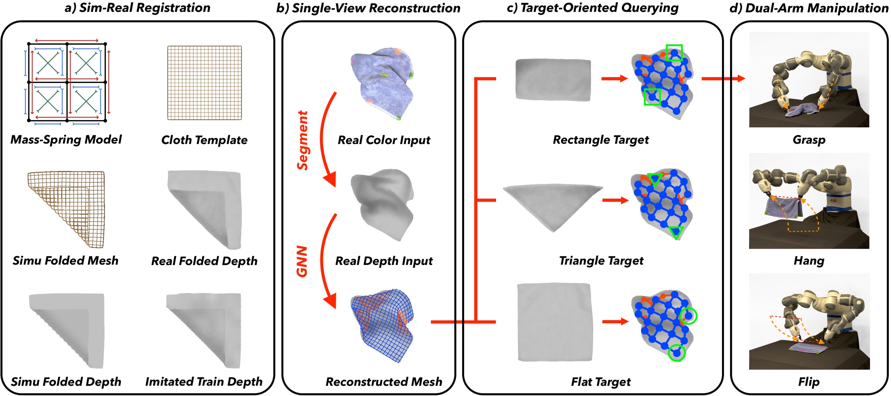
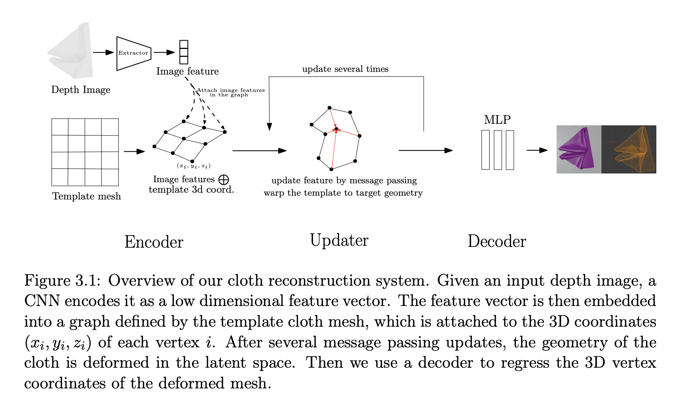
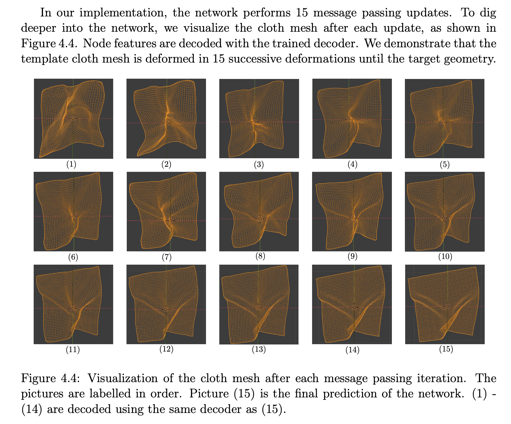
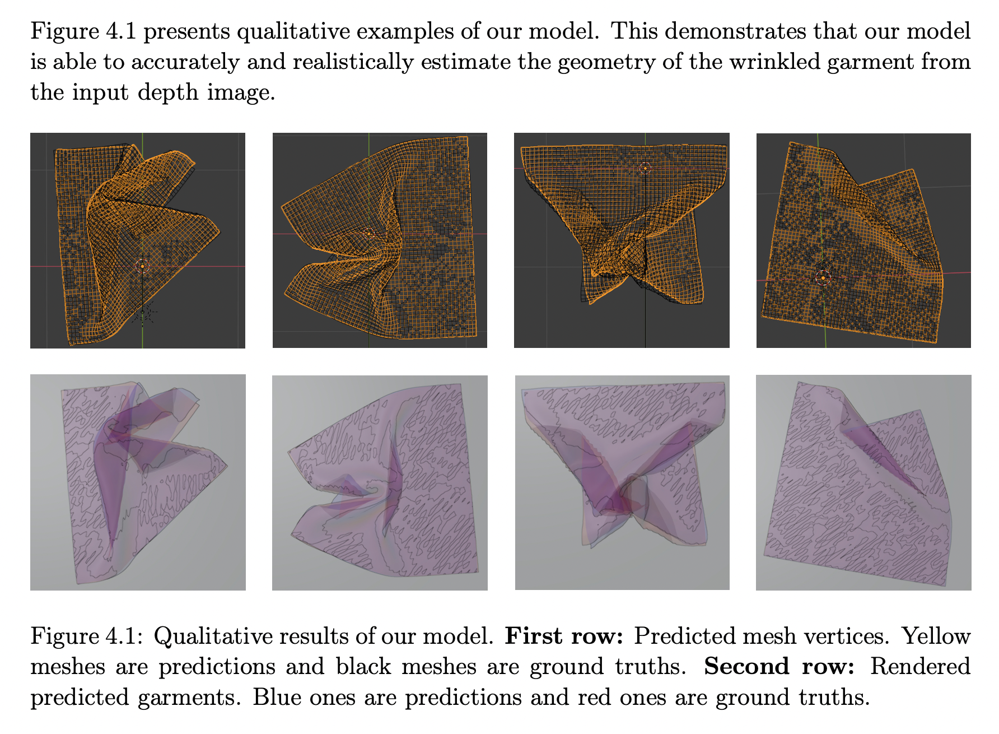
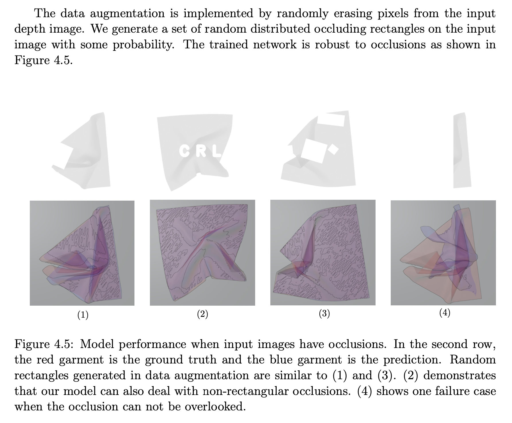

# <p align="center">TRTM: Template-based Reconstruction and Target-oriented Manipulation of Crumpled Cloths </p>

####  <p align="center"> [Wenbo Wang](), [Gen Li](https://vlg.inf.ethz.ch/team/Gen-Li.html), [Miguel Zamora](), [Stelian Coros](https://crl.ethz.ch/people/coros/index.html)</p>

### <p align="center"> ICRA 2024

### <p align="center">[ArXiv](https://arxiv.org/abs/2308.04670) | [Project Page](https://wenbwa.github.io/TRTM/)

<p align="center">
  
</p><p align="center">
  Precise reconstruction and manipulation of the crumpled cloths is challenging due to the high dimensionality of cloth models, as well as the limited observation at self-occluded regions. We leverage the recent progress in the field of single-view human reconstruction to template-based reconstruct crumpled cloths from their top-view depth observations only, with our proposed sim-real registration protocols. In contrast to previous implicit cloth representations, our reconstruction mesh explicitly describes the positions and visibilities of the entire cloth mesh vertices, enabling more efficient dual-arm and single-arm target-oriented manipulations. Experiments demonstrate that our TRTM system can be applied to daily cloths that have similar topologies as our template mesh, but with different shapes, sizes, patterns, and physical properties.
</p>

## Disclaimer

My semester project at ETH Zurich. This code repo **only** contains the code for the reconstruction part. The manipulation part is not done by me. 

The code implementation might have some discrepancies with the ICRA 2024 paper, however, it is fully compatible with my semester project report. But the difference is negligible.

This task is to reconstruct the geometry of a wrinkled garment/deformed cloth using a single-view depth simulated image.

The idea of using a Graph Neural Network to model the deformed cloth is inspired by MeshGraphNets: https://arxiv.org/pdf/2010.03409.pdf

The idea of using template-based deformation to model the geometry estimation of wrinkled garments is inspired by https://arxiv.org/abs/1905.03244.

Part of the code is adapted from the Pytorch implementation of meshgraphnets from https://github.com/wwMark/meshgraphnets.

## Paper/Report
My semester project report: https://github.com/ligengen/Deformed-cloth-reconstruction/blob/main/Semester_Project_Report.pdf

ICRA 2024 Arxiv: https://arxiv.org/abs/2308.04670

## Method overview


## Deformation (message passing) visualization


## Qualitative visualization


## Data augmentation for occlusion



## Code for training a new model:
```
python main.py
```

## Code for testing a model:
```
python main.py --phase=test --pt_file=./experiments/exp_288759_resnet34_edge_no_image_feature_attention/bestmodel_0189_0.0082321205.pt

```
### Modify parameters according to your needs

## Citation
```
@article{wang2023trtm, 
 title={TRTM: Template-based Reconstruction and Target-oriented Manipulation of Crumpled Cloths}, 
 authors={Wenbo Wang and Gen Li and Miguel Zamora and Stelian Coros}, 
 booktitle={IEEE International Conference on Robotics and Automation (ICRA)},
 year={2024}
}
```
